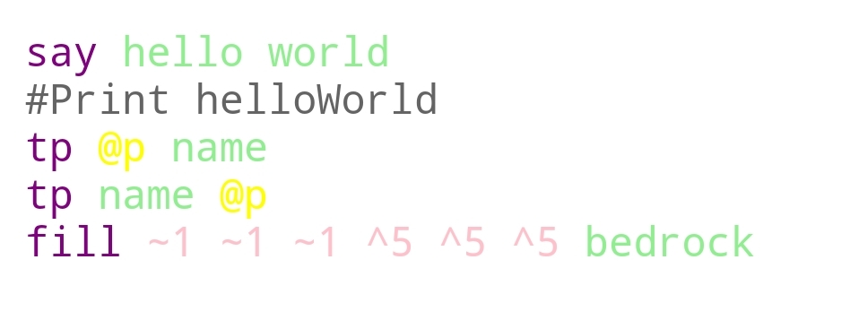

# Mcfunction highlight
This module is use on **mcfunction** highlight !
<br>
### Method
*mcfHighLight( mcfunction : string ) : string*<br>
**Please put string to a pre element!!!**<br>
- mcfunction<br>
--- mcfunction code<br>
### Style sheet
*Please use "code.css" on ur page if ur dont want make new style class*<br>
| class | color |
| --- | --- |
| mcf-cmd | purple |
| mcf-arg | lightgreen |
| mcf-num | pink |
| mcf-type | yellow |
### Example
```js
function main( ele ){
    ele.innerHTML = mcfHighLight( `
    say hello world
    #Print helloWorld
    tp @p name
    tp name @p
    fill ~1 ~1 ~1 ^5 ^5 ^5 bedrock`)
}
main(document.getElementById( "load"))
```